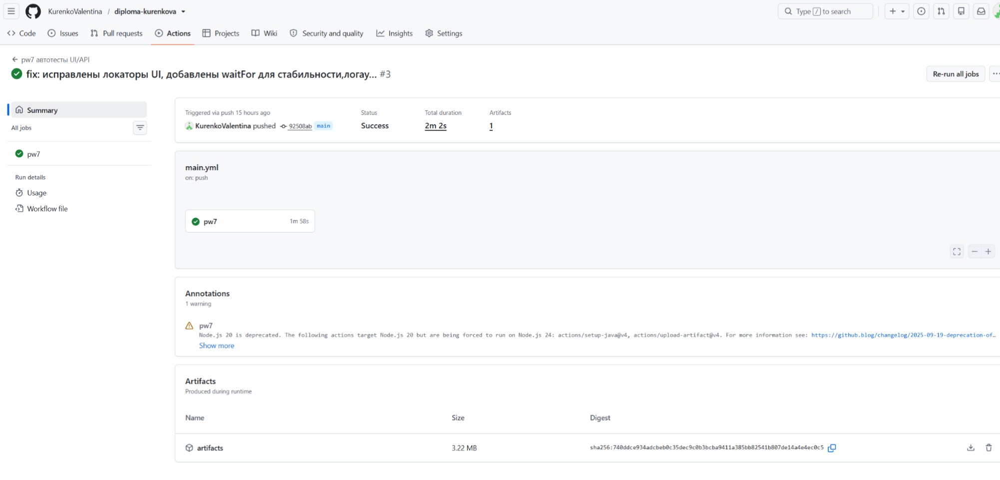
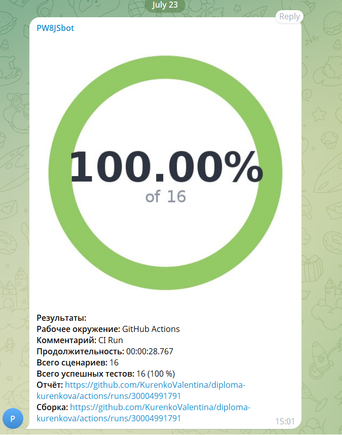

# 🎓 Дипломная работа QA.GURU | JS + Playwright | Автоматизация тестирования UI и API | 7 поток

[](https://playwright.dev/)
[](https://developer.mozilla.org/ru/docs/Web/JavaScript)
[](https://docs.qameta.io/allure/)
[](https://github.com/features/actions)
[](https://www.jenkins.io/)

## 📑 Содержание

- [📝 Описание](#-описание)
- [🛠️ Технологический стек](#-технологический-стек)
- [📂 Структура проекта](#-структура-проекта)
- [🚀 Запуск тестов](#-запуск-тестов)
- [🔄 Запуск в CI/CD](#-запуск-в-cicd)
- [📊 Отчетность](#-отчетность)
- [🔔 Уведомления](#-уведомления)

---

## 📝 Описание

Дипломный проект, выполненный в рамках курса по автоматизации тестирования на JavaScript + Playwright. Проект включает UI и API тесты с интеграцией в CI/CD pipeline.

UI тесты — 8 функциональных автотестов для приложения [realworld.qa.guru](https://realworld.qa.guru/).
API тесты — 8 функциональных автотестов для сервиса [apichallenges.eviltester.com](https://apichallenges.eviltester.com/gui/challenges).
Применённые паттерны:

- **Page Object Model** — для UI тестов
- **Service Object Model** — для API тестов
- **Builder Pattern** — для генерации тестовых данных
- **Fixtures** — для переиспользования настроек
- **Facade (Фасад)** — агрегация Page Objects и сервисов
- **Barrel (Баррель / `index.js`)** — централизованный экспорт модулей через файлы-агрегаторы для упрощения, чистоты импортов и удобства рефакторинга

---

## 🛠️ Технологический стек

Данный проект был написан на языке программирования JavaScript с использованием фреймворка Playwright. Для хранения исходного кода и запуска рабочих процессов используется облачная платформа GitHub с GitHub Actions.
Генерация отчетов о пройденных тестах формируется в Allure с отправкой отчетности в тест-менеджмент TestOps для анализа результатов и управления дефектами.
Уведомления о статусе выполнения тестов отправляются в чат Telegram посредством бота.

- **Фреймворк:** Playwright (JavaScript)
- **Архитектура:** Page Object Model (POM), Builder Pattern, Custom Fixtures
- **Отчетность:** Allure Report, Allure TestOps, HTML Report Playwright
- **CI/CD:** GitHub Actions / Jenkins
- **Уведомления:** Allure Notifications (Telegram)
- **Линтинг:** ESLint, Prettier

---

## 📂 Структура проекта

```text
diploma-kurenkova/
├── .github/
│   └── workflows/
│       └── main.yml                  # Конфигурация CI/CD (GitHub Actions)
├── notifications/
│   └── config.json                   # Настройки уведомлений Allure (Telegram)
├── src/
│   ├── helpers/
│   │   ├── builders/                 # Builder Pattern (UserBuilder, ArticleBuilder и т.д.)
│   │   └── fixtures/                 # Кастомные фикстуры Playwright
│   ├── pages/                        # Page Objects для UI-тестов (MainPage, YourfeedPage и др.)
│   └── services/                     # API-клиенты и обертки для запросов
├── tests/
│   ├── api/
│   │   └── api.spec.js               # API-тесты (CRUD, аутентификация, валидация)
│   └── ui/
│       └── ui.spec.js                # UI-тесты (E2E сценарии, формы, навигация)
├── .gitignore                        # Игнорируемые файлы Git
├── Dockerfile                        # Образ Docker для запуска тестов в изолированном окружении
├── Jenkinsfile                       # Declarative Pipeline для Jenkins
├── package.json                      # Зависимости и npm-скрипты
├── playwright.config.js              # Конфигурация Playwright (проекты, ретраи, репортеры)
└── README.md                         # Документация проекта
```

---

## 🚀 Запуск тестов

### 1. Предварительные требования

Перед запуском убедись, что у тебя установлены:

- **Node.js** >= 18.x ([скачать](https://nodejs.org/))
- **npm** >= 9.x (идет в комплекте с Node.js)
- **Git** ([скачать](https://git-scm.com/))

### 2. Установка

```bash
# Клонирование репозитория
git clone https://github.com/KurenkoValentina/diploma-kurenkova.git
cd diploma-kurenkova

# Установка зависимостей
npm ci

# Установка браузеров Playwright
npx playwright install
```

### 3️. Настройка переменных окружения

Скопируй файл с примером и заполни своими данными:

```bash
cp .env.example .env
```

Открой файл `.env` и укажи необходимые URL:

```env
UI_URL=https://realworld.qa.guru
API_URL=https://realworld.qa.guru/api
```

### 4️. Запуск тестов

| Команда            | Описание                                  |
| ------------------ | ----------------------------------------- |
| `npm run test`     | Запуск всех тестов (UI + API)             |
| `npm run t1`       | Запуск только UI-тестов                   |
| `npm run t2`       | Запуск только API-тестов                  |
| `npm run t:headed` | Запуск с открытым браузером (для отладки) |
| `npm run t:debug`  | Запуск в режиме отладки (пошагово)        |

### 5️. Просмотр отчетов

| Команда           | Описание                                  |
| ----------------- | ----------------------------------------- |
| `npm run report`  | Открыть встроенный HTML-отчет Playwright  |
| `npm run allureG` | Сгенерировать отчет Allure из результатов |
| `npm run allureO` | Открыть отчет Allure в браузере           |

---

## 🔄 Запуск в CI/CD

### GitHub Actions

Тесты автоматически запускаются при push в ветку main


### Jenkins

## 📊 Отчетность

Для построения отчетов о пройденных тестах в данном проекте использовался Allure.

### Allure (Jenkins)

### Allure (GitHub Actions / локально)

### Результаты тестов автоматически передаются в Allure TestOps:

## 🔔 Уведомления

После каждого запуска тестов приходит уведомление с результатами:

